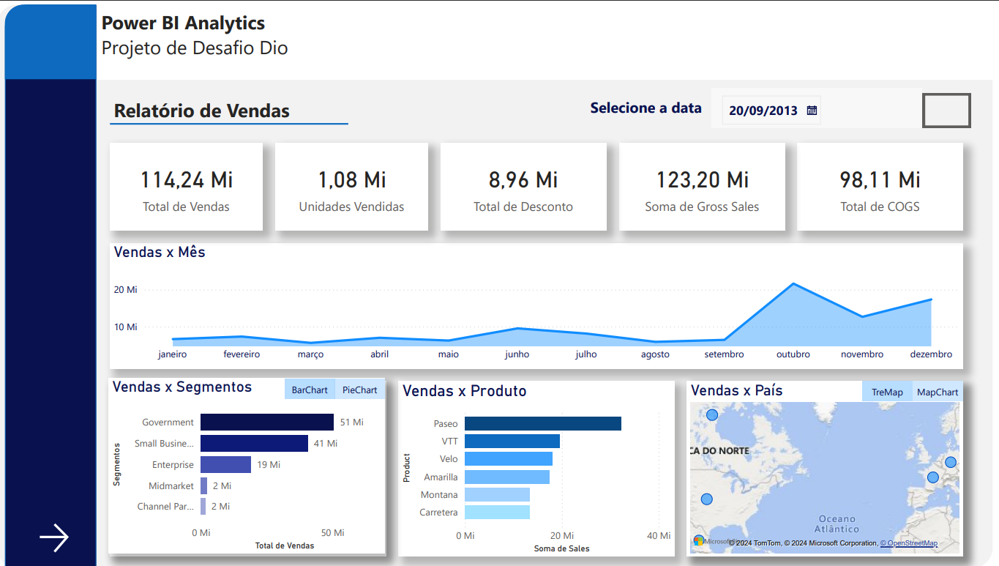
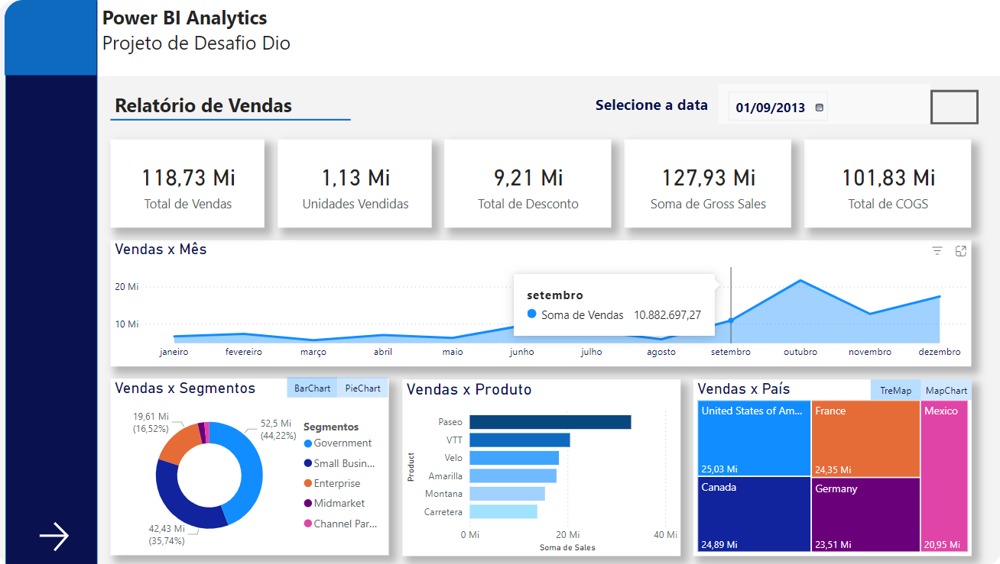
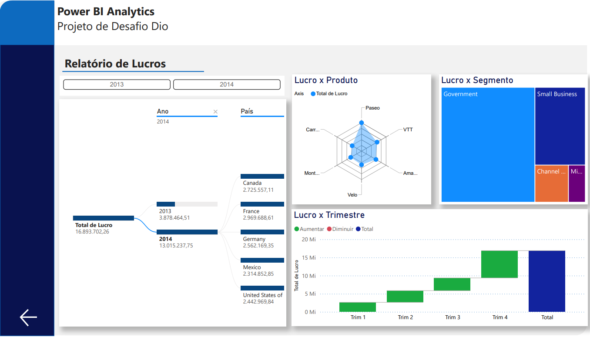

# Relatório de Vendas 📊

O projeto tem como objetivo criar um relatório analítico de vendas e lucros, utilizando a base de dados [sample financials](https://github.com/julianazanelatto/power_bi_analyst/blob/main/dataset/Financial%20Sample.xlsx).

A base de dados "Sample Financials" no Power BI é uma coleção de dados de exemplo projetada para fornecer aos usuários do Power BI a oportunidade de explorar e praticar análises financeiras. Essa base de dados fictícia é composta por dados simulados que representam as operações financeiras de uma empresa.

## Objetivos Específicos 🎯
- [X] Estruturar e definir um escopo do layout padrão para o dashboard
- [X] Criar botões de navegação que fornecem navegabilidade ao usuário;
- [ ] Utilizar os segmentadores e botões com imagem associadas 
- [X] Utilizar os indicadores e botões para selecionar diferentes visuais sobre um mesmo assunto. 

## Métricas 🧮

As métricas apresentadas na tabela fornecem uma visão abrangente do desempenho financeiro da empresa fictícia. Elas incluem métricas de vendas, como total de vendas, unidades vendidas e vendas por segmento, produto e país. Além disso, também são apresentadas métricas de lucro, como lucro por produto, lucro por segmento e lucro por trimestre e ano. Essas métricas são essenciais para avaliar o desempenho financeiro, identificar tendências e tomar decisões estratégicas dentro da organização.

| Métrica              |Descrição              |
|----------------------|-------------------------|
| Total de vendas      | Total de vendas  realizadas                      |
| Unidades vendidas    | Total de unidades vendidas                      |
| Total de descontos   | Total de descontos aplicados                    |
| Total de COGS        | Custo dos produtos vendidos                     |
| Vendas por mês       | Total de vendas por mês                         |
| Vendas por segmentos | Total de vendas por segmentos                   |
| Vendas por produtos  | Total de vendas por produtos                    |
| Vendas por país      | Total de vendas por país                        |
| Vendas por segmentos | Total de vendas por segmentos                   |
| Lucro por produto    | Lucro obtido por produto                        |
| Lucro por segmentos  | Lucro obtido por segmento de mercado            |
| Lucro por trimestre  | Lucro obtido por trimestre do ano               |
| Lucro por ano e país | Lucro obtido por ano e país de venda            |

## Dashboard 📈
O 
[dashboard](https://app.powerbi.com/view?r=eyJrIjoiMTM0ODI2YjEtYTllZC00Y2MyLWI3OTgtM2ViZjViMWZjZmMzIiwidCI6ImI3ZWQ2N2FmLWJhNDAtNDA0MC1hMzg2LWFiNTNhMGFkM2U5NiJ9)
é construido segundo os critérios e métricas estipulados acima. É possivél iteragir no painel como ilustrado abaixo.

  
   
  <em>Figura 1: dashboard de vendas e lucro</em>

As outras visões do painel são exibidas nas imagens abaixo. Na primeira visão, no relatório de vendas existem gráficos diferentes que realizam a mesma análise sobre os dados. E na Visão seguinte, é possivél observar um relatório dos lucros da empresa.

  
   
  
   
  
   
  <em>Figura 2: visões do dashboard de vendas e lucro</em>

# Tecnologias Utilizadas

- Power BI
- Excel

# Referências
- Desafio DIO: [Visualização e Análise de dados com Power BI](https://web.dio.me/project/criando-um-relatorio-de-vendas-elegante-com-power-bi/learning/a9f091aa-5d5c-40c6-bb91-0aa2b30981c4?back=/track/bootcamp-squadio&tab=undefined&moduleId=undefined)
- Base de Dados: [Sample Financials](https://github.com/julianazanelatto/power_bi_analyst/blob/main/dataset/Financial%20Sample.xlsx)
- Tutora: [Juliana Mascarenhas](https://www.linkedin.com/in/juliana-mascarenhas-00349426/)
